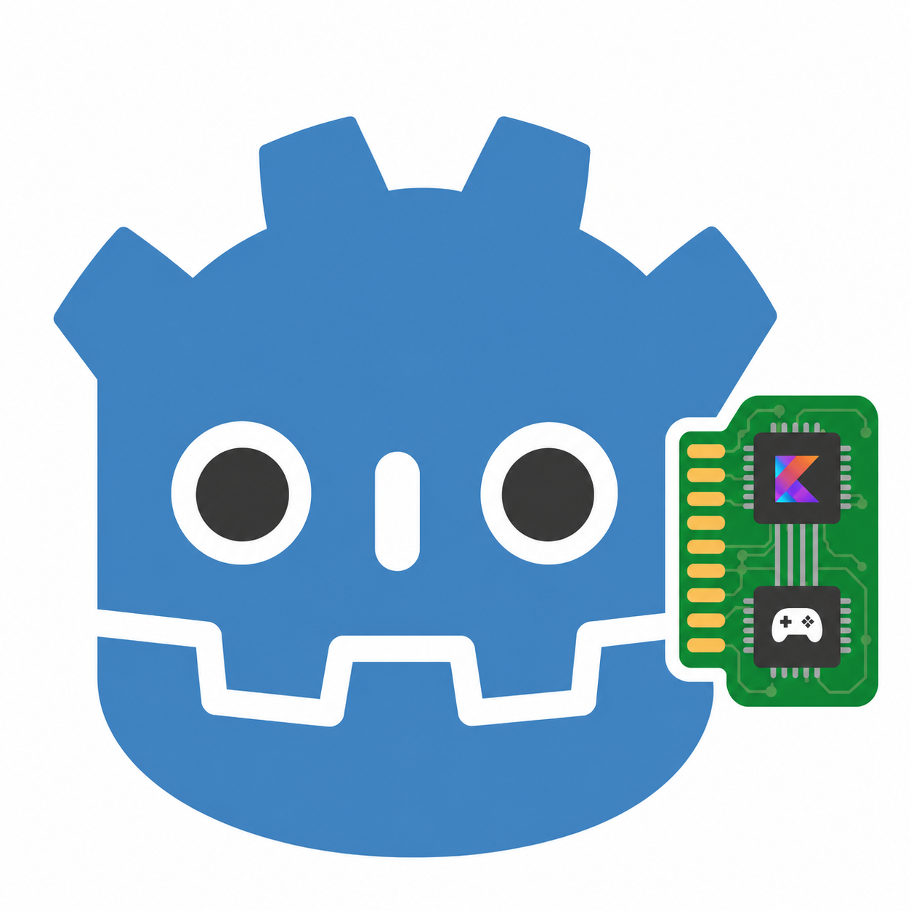

<p align="center">
  
</p>

<h1 align="center">Kanama</h1>

<p align="center">
  Kotlin for Godot through a GDExtension runtime powered by the JVM and the
  Foreign Function & Memory API.
</p>

<p align="center">
  <a href="LICENSE"></a>
  
  
  
  
</p>

Kanama lets Kotlin scripts attach to Godot nodes through a GDExtension runtime.
In the Godot editor, Kanama `.kt` files appear as script resources and can be
attached directly to nodes like `.gd` scripts. Kanama aims to preserve the
Godot workflow while giving game code access to Kotlin, Gradle, coroutines, and
the JVM ecosystem.

## Related Projects

Kanama is experimental and uses a Panama/FFM-based GDExtension architecture.
If you want a more established Kotlin integration for Godot today, also
evaluate [Godot Kotlin/JVM](https://godot-kotl.in/en/stable/). It is a
separate project with a different runtime and export model.

## Status

Kanama is desktop-first. The `0.3.0` preview baseline is
Godot 4.7 stable. macOS arm64 is **supported** on 4.7 stable; Linux and Windows
are supported pending 4.7-stable revalidation. Use the
[Godot 4.7 stable archive](https://godotengine.org/download/archive/4.7-stable/)
for compatible editor/player binaries and Android export templates. Desktop
release kits and store add-ons are package artifacts that can be built from
source today and are the intended release path; exported-game packaging remains
a separate release-readiness track.

Android support is experimental but **device-validated** for the v0.3.0 line: the
workflow builds a Godot Android plugin AAR and uses
[PanamaPort](https://github.com/vova7878/PanamaPort) for the Android FFM layer.
The Godot 4.7 stable debug demo matrix, an R8-minified Match3 release APK, and
the nine-demo Vulkan/Mobile renderer smoke all pass on a physical Pixel 7. The
R8/minified path is validated against Kanama's PanamaPort fork, not upstream.

iOS support is an experimental Kotlin/Native backend: a C GDExtension shim plus
a Kotlin/Native static `.xcframework` run full Kanama project scripts through the
same wrapper generator as desktop/Android, with no JVM on device. The full
device gate (fresh-project install + nine-demo matrix) has passed on both
iPhone 12 and iPhone 15 Pro, with one FPS Audio autoload follow-up tracked as
non-blocking. iOS remains experimental, not a supported export — see the
[iOS (Experimental)](docs/exporting/ios.md) export guide and
[Version Support](docs/reference/version-support.md).

Web export is not planned.

See [Version Support](docs/reference/version-support.md) for the current test matrix and
the `0.3.0` public preview criteria.

## Highlights

- Kotlin scripts attach to Godot nodes like GDScript
- No engine fork, no engine module, no JNI glue in game code
- Desktop runtime powered by the JDK Foreign Function & Memory API
- Experimental Android runtime through Godot's Android plugin AAR flow
- Experimental iOS runtime through a Kotlin/Native `.xcframework` (no on-device JVM)
- Hot reload and editor build tools for a fast iteration loop
- Full Godot 4.7 class coverage (1036/1036 wrapped classes, generated KDoc from
  Godot docs; engine virtuals overridable via `@OverrideVirtual`)
- Desktop-first: macOS arm64 is the primary 4.7 stable validation path; Windows
  x64, Linux x64, and Linux ARM64 remain tracked smoke targets

## Requirements

Desktop/editor workflow:

- Godot 4.7 stable from the
  [Godot 4.7 stable archive](https://godotengine.org/download/archive/4.7-stable/)
- JDK 25+ (Temurin 25 recommended)
- CMake 3.22.1+ and a platform C toolchain for source checkout workflows that
  build the desktop native bootstrap locally; release kits already include the
  platform bootstrap
- macOS arm64, Windows x64, Linux x64, or Linux ARM64 for the current
  editor/runtime smoke paths

Experimental Android export workflow:

- Godot 4.7 stable Android export templates from the
  [Godot 4.7 stable archive](https://godotengine.org/download/archive/4.7-stable/);
  Kanama's stable emulator smoke path and the Pixel 7 device gate (debug demo
  matrix + R8-minified Match3 release APK) have both passed
- Android SDK API 36, build-tools 36.1.0, and NDK 29.0.14206865 for Godot export
- CMake 3.22.1 for the Kanama Android plugin native bootstrap
- JDK 21 for Android Gradle/export tooling
- JDK 25 for normal Kanama desktop development

## Quick Start

Use a source checkout for the current public onboarding path:

```sh
git clone https://github.com/falcon4ever/kanama
cd kanama
./gradlew createStarterProject \
  -PkanamaStarterProjectDir=/path/to/kanama-starter
./gradlew installAddonJar \
  -PkanamaProjectDir=/path/to/kanama-starter \
  -PkanamaProjectScriptsDir=/path/to/kanama-starter
```

Open `kanama-starter/project.godot` in Godot and press **Play**. After editing
`kotlin-src/HelloScript.kt`, press **Build Scripts** in Godot or rerun
`./gradlew buildScripts`.

Package tasks can also build local desktop kit and store-addon zips for smoke
testing:

```sh
./gradlew packageDistributions
```

If a matching GitHub zip release exists, a release kit can be used for a new
project:

```sh
unzip kanama-desktop-kit-v<version>-<platform>.zip -d kanama-starter
cd kanama-starter
./gradlew buildScripts
```

For an existing Godot project and a locally built or published store-addon zip,
unzip it at the project root, then initialize the project:

```sh
sh addons/kanama/setup-kanama-project.sh
./gradlew buildScripts
```

The release-kit and store-addon pages describe those generated zip shapes; they
become download flows once matching release artifacts are published.

## Example

```kotlin
package com.example.game

import net.multigesture.kanama.annotations.OnReady
import net.multigesture.kanama.annotations.ScriptClass
import net.multigesture.kanama.api.GD
import net.multigesture.kanama.api.KanamaScript
import net.multigesture.kanama.api.Node
import java.lang.foreign.MemorySegment

@ScriptClass(attachTo = "Node")
class HelloKanama(godotObject: MemorySegment) :
    KanamaScript<Node>(godotObject, ::Node) {
    @OnReady
    fun ready() {
        GD.print("Hello from Kotlin")
    }
}
```

## Documentation

The latest public documentation is published at
[falcon4ever.github.io/kanama](https://falcon4ever.github.io/kanama/).

- [Getting Started](docs/getting-started/index.md)
- [Use a Release Kit](docs/getting-started/release-kit.md)
- [Use a Store Addon](docs/getting-started/store-addon.md)
- [Use a Source Checkout](docs/getting-started/source-checkout.md)
- [Work on Kanama](docs/getting-started/work-on-kanama.md)
- [The Editor Loop](docs/getting-started/editor-workflow.md)
- [Writing Kotlin Scripts](docs/game-dev/scripts.md)
- [Calling Godot APIs](docs/game-dev/godot-api.md)
- [Exports and Resources](docs/game-dev/properties-resources.md)
- [Signals and Callbacks](docs/game-dev/signals.md)
- [Porting GDScript](docs/game-dev/porting-gdscript.md)
- [Kotlin Style](docs/game-dev/style-guide.md)
- [Desktop and Packaging](docs/exporting/desktop.md)
- [Android Experimental](docs/exporting/android.md)
- [iOS (Experimental)](docs/exporting/ios.md)
- [Version Support](docs/reference/version-support.md)
- [API Coverage](docs/contributing/api-coverage.md)
- [C# Comparison](docs/reference/c-sharp-compat.md)
- [Changelog](CHANGELOG.md)
- [Contributor Guide](docs/contributing/index.md)

To preview documentation changes locally:

```sh
pip install -r docs/requirements.txt
mkdocs serve
```

## Demos

The companion demo repository is
[falcon4ever/kanama-demos](https://github.com/falcon4ever/kanama-demos). Keep
it beside this checkout:

```text
dev/
  kanama/
  kanama-demos/
```

Current demo ports cover starter kits, official Godot demos, and GDQuest 3D
controller demos. The demo repo is also where new wrappers are validated
against real gameplay before release.

## Contributing

See [CONTRIBUTING.md](CONTRIBUTING.md).

## License

MIT. See [LICENSE](LICENSE).
