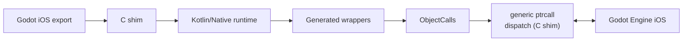

# iOS (Experimental)

Kanama's iOS backend is experimental but proven viable on device: it runs full
Kanama project scripts through the same generated Godot API wrappers as
desktop/Android. It is not yet a supported export.

Use the
[Godot 4.7 stable archive](https://godotengine.org/download/archive/4.7-stable/)
for the matching editor binary and iOS export templates.

The design is:

- Godot GDExtension entry point in a small C shim,
- Kotlin/Native static library linked into the same iOS `.xcframework`,
- no desktop JVM, GraalVM, or TeaVM in the iOS app, and
- physical-device validation first; simulator builds are optional compile/link
  checks and are not used as a performance signal.

## Current Status

The iOS backend builds debug and release iOS `.xcframework` artifacts with
device `arm64` and optional Apple Silicon simulator `arm64` slices, and runs
full Kanama project scripts through generated Godot API wrappers over a C-shim
generic `ptrcall`.

The **full ten-step device gate** (`scripts/ios_device_gate.sh`: the
fresh-project install path plus the nine-demo matrix) is validated on two
physical models: **iPhone 12** (iOS 26.5, 2026-06-25; 0 guardrail hits,
per-frame Kanama binding overhead about 0.63 ms/frame measured there) and
**iPhone 15 Pro** (iOS 26.5, 2026-07-10, on the full-breadth generated-wrapper
runtime). The claim names those two models — it is not a device-family
("recent iPhones") claim.

iOS is still **experimental, not a supported export**. It should not be
presented as a production mobile target or desktop-level support claim. Treat it
as a validated experimental backend for Kanama development and demo/device
testing while the remaining support gates are cleared — see
[Version Support](../reference/version-support.md).

## Toolchain

Use the current Kanama preview baseline:

| Tool | Version / Setting |
|---|---|
| Godot | 4.7 stable |
| Godot export templates | 4.7 stable iOS templates |
| Desktop runtime/build JDK | JDK 25+ |
| Xcode | 26.5 or newer enough to provide the installed iOS SDK |
| iOS runtime | Kotlin/Native static library inside an `.xcframework` |
| Device architecture | `arm64` |
| Minimum iOS version | 14.0 by default |

Install the Godot iOS export templates for the same Godot version that opens or
exports the project. If `xcode-select` points at Command Line Tools, set
`DEVELOPER_DIR` for Gradle and Xcode commands so Kotlin/Native and Xcode use the
full Xcode app.

Configure signing through Xcode, Godot export presets, or standard Apple
Developer account setup. Do not commit workstation-local paths, device UDIDs,
team IDs, provisioning profile names, or private maintainer notes.

## Runtime Shape



See [Architecture: iOS](../contributing/architecture.md#ios-experimental) for
how this maps onto the desktop/Android runtime model.

## Build The iOS Artifacts

From the Kanama checkout, build the device `.xcframework` artifacts:

```sh
DEVELOPER_DIR=/Applications/Xcode.app/Contents/Developer \
./gradlew assembleIosDeviceKanamaXcframework \
  -PkanamaXcodeDeveloperDir=/Applications/Xcode.app/Contents/Developer
```

The task writes:

```text
build/ios/xcframework-device/debug/kanama_ios.debug.xcframework
build/ios/xcframework-device/release/kanama_ios.release.xcframework
```

`installIosAddon` also defaults to device-only xcframeworks. Pass
`-PkanamaIosXcframeworkMode=full` only when intentionally building the optional
device plus simulator xcframeworks.

## Packaged iOS Addon (prebuilt runtime)

Maintainers can package the prebuilt device runtime as a zip:

```sh
DEVELOPER_DIR=/Applications/Xcode.app/Contents/Developer \
./gradlew packageMobileAddonIos \
  -PkanamaXcodeDeveloperDir=/Applications/Xcode.app/Contents/Developer
```

This writes `build/distributions/kanama-mobile-addon-ios-v<version>.zip`
containing both device `arm64` xcframeworks (debug + release — the static
libraries are large, roughly 200 MB debug / 88 MB release before zip), a
`.gdextension` entries fragment to merge, and an install README.

**Honest caveat:** the packaged addon delivers the *runtime* only. Compiling a
project's Kotlin scripts for iOS still requires a Kanama source checkout
(`installIosAddon` runs the Kotlin/Native + KSP build). Use the zip to update
the prebuilt runtime or for script-less evaluation; the source-checkout flow
below remains the full workflow.

Validate a packaged zip without a device:

```sh
scripts/package_install_smoke.sh --ios-addon \
  build/distributions/kanama-mobile-addon-ios-v<version>.zip
```

## Install Into A Project

Install the Kanama iOS addon into a Godot project:

```sh
DEVELOPER_DIR=/Applications/Xcode.app/Contents/Developer \
./gradlew installIosAddon \
  -PkanamaIosProjectDir=/absolute/path/to/godot_project \
  -PkanamaXcodeDeveloperDir=/Applications/Xcode.app/Contents/Developer
```

If the project has Kotlin scripts in `kotlin-src/`, also pass the script source
directory so the iOS Kotlin/Native runtime is built with the project's generated
registrars:

```sh
DEVELOPER_DIR=/Applications/Xcode.app/Contents/Developer \
./gradlew installIosAddon \
  -PkanamaIosProjectDir=/absolute/path/to/godot_project \
  -PkanamaIosProjectScriptsDir=/absolute/path/to/godot_project/kotlin-src \
  -PkanamaProjectScriptsDir=/absolute/path/to/godot_project/kotlin-src \
  -PkanamaXcodeDeveloperDir=/Applications/Xcode.app/Contents/Developer
```

Passing both script directory properties keeps iOS and desktop/editor metadata
in sync during export. The export-time editor uses the desktop metadata to keep
scene-stored `@ScriptProperty` values, and the iOS runtime uses the iOS
registrars to load the scripts on device.

This installs the iOS descriptor entries:

```ini
[configuration]
entry_symbol = "kanama_entry"
compatibility_minimum = "4.7"

[libraries]
ios.debug.arm64 = "res://addons/kanama/bin/ios/kanama_ios.debug.xcframework"
ios.release.arm64 = "res://addons/kanama/bin/ios/kanama_ios.release.xcframework"
```

### Coexistence With Desktop And Android

`installIosAddon` writes the iOS xcframeworks and preserves the normal desktop
Kanama library entries in `addons/kanama/kanama.gdextension`. If the project
already has Android plugin metadata, the task also preserves the Android AAR
entries instead of replacing them.

After install, one Kanama addon can contain desktop, Android, and iOS entries.
Do not hand-edit the `.gdextension` file to remove another platform unless the
project is intentionally dropping that platform.

For simulator experiments, add `-PkanamaIosXcframeworkMode=full`.

## Godot Export Requirements

An iOS export needs the normal Godot iOS setup plus the installed Kanama iOS
addon:

- Godot 4.7 stable editor or headless binary.
- Godot 4.7 stable iOS export templates installed.
- A Godot export preset named `iOS`, or the equivalent preset name used in your
  command.
- `architectures/arm64=true` for physical-device builds.
- `application/export_project_only=true` if you want Godot to write an Xcode
  project that you build and install yourself.
- A unique `application/bundle_identifier`.
- A valid Apple Development team, signing certificate, and provisioning setup
  for the target device.
- `addons/kanama/kanama.gdextension` registered in `.godot/extension_list.cfg`.

For a fresh project, create the export preset in Godot's Export window, choose
iOS, set the bundle identifier, select signing/team values, and save the preset
before using the CLI examples below.

### Signing And Provisioning

iOS device installs require an Apple Development certificate, a provisioning
profile that includes the connected device, and a bundle identifier owned by the
selected Apple team. Xcode's automatic signing can create or update development
profiles when the Apple account has permission; otherwise create the identifier
and profile in the Apple Developer portal, then select them in Xcode or the
Godot export preset.

Keep signing values local. Public docs and committed scripts should use
placeholders for device identifiers, team IDs, and profile names.

Common failures:

| Symptom | Likely Cause / Fix |
|---|---|
| Godot cannot export for iOS | Install the iOS export templates for the same Godot 4.7 stable editor. |
| Xcode reports no signing team | Set the Apple Development team in the export preset or Xcode project. |
| Xcode cannot create a provisioning profile | Sign in to Xcode with an Apple Developer account and allow provisioning updates, or create the profile in the Apple Developer portal. |
| Device is not a valid destination | Connect and trust the iPhone, enable Developer Mode, and use `xcrun devicectl list devices` to confirm the device identifier. |
| Kanama scripts load without scene property values | Re-run `installIosAddon` with both `-PkanamaIosProjectScriptsDir` and `-PkanamaProjectScriptsDir`. |
| Godot warns about a missing iOS GDExtension library | Re-run `installIosAddon` and confirm the `ios.debug.arm64` and `ios.release.arm64` entries exist. |

## Export An iOS App

Export from the Godot editor or with the CLI. The CLI form mirrors Godot's
normal iOS export path. With `application/export_project_only=true`, Godot
writes an Xcode project into the directory of the export path instead of
producing an `.ipa`:

```sh
godot --headless \
  --path /absolute/path/to/godot_project \
  --export-debug iOS /absolute/path/to/export/KanamaGame.ipa
```

Use `--export-release` for a release preset after signing and provisioning are
configured for release. The generated Xcode project is the next step for device
install and launch.

## Run On Device

Open the generated `.xcodeproj` in Xcode, select a connected iPhone, confirm the
signing team, and run the app.

For command-line installs, use the generated Xcode project with your own bundle
identifier, device identifier, and team value:

```sh
DEVELOPER_DIR=/Applications/Xcode.app/Contents/Developer \
xcodebuild \
  -project /absolute/path/to/export/KanamaGame.xcodeproj \
  -scheme KanamaGame \
  -configuration Debug \
  -sdk iphoneos \
  -destination "id=<your-device-udid>" \
  -derivedDataPath /absolute/path/to/derived-data \
  CODE_SIGNING_ALLOWED=YES \
  CODE_SIGN_STYLE=Automatic \
  DEVELOPMENT_TEAM=<your-apple-team-id> \
  build
```

Then install and launch the built app:

```sh
DEVELOPER_DIR=/Applications/Xcode.app/Contents/Developer \
xcrun devicectl device install app \
  --device <your-device-udid> \
  /absolute/path/to/derived-data/Build/Products/Debug-iphoneos/KanamaGame.app

DEVELOPER_DIR=/Applications/Xcode.app/Contents/Developer \
xcrun devicectl device process launch \
  --device <your-device-udid> \
  --terminate-existing \
  com.example.kanamagame
```

If Xcode is allowed to manage profiles for this app, add
`-allowProvisioningUpdates` to the `xcodebuild` command. For public docs and
committed scripts, keep device identifiers and Apple team IDs as placeholders.
Maintainers should keep real values in private handoff notes or their local
shell environment.

## Optional Simulator Template Check

Only do this when deliberately using the simulator path. Before simulator work
on Apple Silicon, verify that the installed Godot iOS export template has an
`arm64` simulator engine archive:

```sh
./gradlew verifyIosGodotTemplate \
  -PkanamaXcodeDeveloperDir=/Applications/Xcode.app/Contents/Developer
```

Or run the script directly:

```sh
scripts/ios_template_preflight.sh \
  --xcode-developer-dir /Applications/Xcode.app/Contents/Developer
```

The simulator path remains available for Xcode link checks and loader-debug
experiments, but it is not a performance gate for Kanama iOS.

If the installed Godot iOS template is missing `arm64` simulator support, build
a matching Godot simulator library and pass it explicitly to maintainer smoke
tooling:

```sh
DEVELOPER_DIR=/Applications/Xcode.app/Contents/Developer \
scons platform=ios target=template_debug arch=arm64 simulator=yes precision=single

scripts/ios_visual_smoke.sh \
  --godot /Applications/Godot.app/Contents/MacOS/Godot \
  --simulator \
  --godot-simulator-lib /absolute/path/to/libgodot.ios.template_debug.arm64.simulator.a \
  --kanama-script-probe
```

Apple Silicon iOS simulators build and run `arm64` simulator binaries. That is
separate from real-device `arm64`, which uses the `iphoneos` SDK instead of the
`iphonesimulator` SDK. Use a real iPhone for any playability or performance
read.

## Optional Maintainer Smoke

The visual smoke script proves the native loader, Xcode device build, app
install, app launch, and a simple Godot render path. With the Kanama probe flags
it can also prove Kotlin/Native frame callbacks, script resources, or full
KSP-generated project script execution. These probes are maintainer validation
tools; they are not the primary user export workflow.

Set `KANAMA_IOS_DEVICE` and, when needed, `KANAMA_IOS_TEAM` in your shell or
private maintainer notes before running the script. Do not commit the real
values.

```sh
scripts/ios_visual_smoke.sh \
  --godot /Applications/Godot.app/Contents/MacOS/Godot \
  --kanama-user-script-probe \
  --allow-provisioning-updates
```

Use lighter probe flags such as `--kanama-probe` or `--kanama-script-probe` for
loader/render checks. None of the modes prove hot reload.

## Current Boundaries

- Physical-device export and launch are the first validation target.
- Simulator startup is optional for compile/link debugging and should not be
  used to judge iOS frame rate or gameplay feel.
- Kanama sets the iOS `AVAudioSession` category to `Ambient` when the iOS shim
  starts. This makes game audio deterministic with the Ring/Silent switch:
  audio plays when the device is in Ring mode, is muted by Silent mode, and can
  mix with other app audio. Projects that intentionally need background/media
  playback semantics should set their own iOS audio session category in native
  platform code after startup.
- Hot reload is out of scope for the iOS backend.
- The audited type set and KSP registration path cover the current demo corpus,
  including the heavy `tps-demo-kanama`. Remaining mobile support work (device-matrix
  breadth, packaging) is tracked in the supported-mobile promotion bar
  ([release-support-decision.md](../internals/release-support-decision.md) §7).
- The runtime calls Godot through backend-neutral generated wrappers and
  prefers cached typed `ptrcall`s over Variant-heavy or allocation-heavy paths.
- The current playable demo set matches the Android-enabled public demo set plus
  Bunnymark; the heavy `tps-demo-kanama` also runs on device (its mobile
  touch/multiplayer UI polish is tracked separately). FPS is playable but still
  has an intermittent Audio autoload follow-up.
