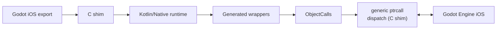

# iOS (Experimental)

Kanama's iOS backend is experimental but proven viable on device — it runs full
Kanama project scripts through the same generated Godot API wrappers as
desktop/Android. It is not yet a supported export.

The design is:

- Godot GDExtension entry point in a small C shim,
- Kotlin/Native static library linked into the same iOS `.xcframework`,
- no desktop JVM, GraalVM, or TeaVM in the iOS app, and
- physical-device validation first; simulator builds are optional compile/link
  checks and are not used as a performance signal.

## Current Status

The iOS backend builds debug and release iOS `.xcframework` artifacts with device
`arm64` and optional Apple Silicon simulator `arm64` slices, and runs **full Kanama
project scripts** through GENERATED Godot API wrappers (the same wrapper generator as
desktop/Android) over a C-shim generic `ptrcall`:



See [Architecture → iOS](../contributing/architecture.md#ios-experimental) for
how this maps onto the desktop/Android runtime model.

The core iOS self-test matrix is device-validated with 0 guardrail hits, and
per-frame Kanama binding overhead measured ~0.63 ms/frame on iPhone 12. The current
demo corpus has also reached playable device runs on iPhone 15 Pro (Match3, 3D
Platformer, Bunnymark, dodge, squash, Racing, character-controller, FPS, and
third-person). iOS is still **experimental, not a supported export**: the remaining
work is export-workflow polish, broader validation, and the explicit backlog in the
[iOS roadmap](../internals/ios-backend-roadmap.md).

This covers the same Android-enabled public demo set currently listed for Android,
plus Bunnymark. FPS is playable but still has an intermittent Audio autoload follow-up.

This means iOS is not at desktop support level, and it should not be presented as a
production mobile target. Treat it as a validated experimental backend: useful for
Kanama development and demo/device testing, but not yet a release-supported export
path for user projects.

## Build The iOS Artifacts

Use Xcode 26.5 or newer enough to provide the installed iOS SDK. If
`xcode-select` points at Command Line Tools, set `DEVELOPER_DIR` for the Gradle
process. Kotlin/Native's Apple linker checks this environment variable
directly.

```sh
DEVELOPER_DIR=/Applications/Xcode.app/Contents/Developer \
./gradlew assembleIosDeviceKanamaXcframework \
  -PkanamaXcodeDeveloperDir=/Applications/Xcode.app/Contents/Developer
```

The task writes:

```text
build/ios/xcframework-device/debug/kanama_ios.debug.xcframework
build/ios/xcframework-device/release/kanama_ios.release.xcframework
```

`installIosAddon` also defaults to the device-only xcframeworks. Pass
`-PkanamaIosXcframeworkMode=full` when intentionally building the optional
device plus simulator xcframeworks.

## Optional Simulator Template Check

Only do this when deliberately using the simulator path. Before simulator work
on Apple Silicon, verify that the installed Godot iOS export template has an
`arm64` simulator engine archive:

```sh
./gradlew verifyIosGodotTemplate \
  -PkanamaXcodeDeveloperDir=/Applications/Xcode.app/Contents/Developer
```

Or run the script directly:

```sh
scripts/ios_template_preflight.sh \
  --xcode-developer-dir /Applications/Xcode.app/Contents/Developer
```

## Install Into A Test Project

```sh
DEVELOPER_DIR=/Applications/Xcode.app/Contents/Developer \
./gradlew installIosAddon \
  -PkanamaIosProjectDir=/absolute/path/to/godot_project \
  -PkanamaXcodeDeveloperDir=/Applications/Xcode.app/Contents/Developer
```

For simulator experiments, add `-PkanamaIosXcframeworkMode=full`.

This installs the iOS descriptor entries:

```ini
[libraries]
ios.debug.arm64 = "res://addons/kanama/bin/ios/kanama_ios.debug.xcframework"
ios.release.arm64 = "res://addons/kanama/bin/ios/kanama_ios.release.xcframework"
```

## Boundaries

- Physical-device export and launch are the first validation target.
- Simulator startup is optional for compile/link debugging and should not be
  used to judge iOS frame rate or gameplay feel.
- Hot reload is out of scope for the iOS backend.
- The audited type set and KSP registration path cover the current demo corpus.
  Remaining support work is tracked explicitly in
  [ios-backend-roadmap.md](../internals/ios-backend-roadmap.md), including export
  workflow polish, `@Rpc` config delivery, and `commonMain` source sharing.
- The runtime calls Godot through backend-neutral generated wrappers and prefers
  cached typed `ptrcall`s over Variant-heavy or allocation-heavy paths.

## Physical Device Smoke

The visual smoke script proves the native loader, Xcode device build, app
install, app launch, and a simple Godot render path. With `--kanama-probe`, it
also proves a Kotlin/Native main-loop frame callback can call back into Godot
through the C shim and update a normal `Label` via typed `ptrcall`.

With `--kanama-script-probe`, it attaches a `.kt` script resource to a normal
`Label` and proves that the iOS shim can create a script resource, create a
Godot script instance, enter Kotlin/Native from `_ready`, and call back into
Godot through a cached typed `ptrcall`.

Use `--kanama-user-script-probe` when you need to prove general Kanama script
execution through KSP-generated registrars and project-specific Kotlin/Native
compilation. The lighter probes are still useful loader/render checks; none of
the modes prove hot reload.

```sh
KANAMA_IOS_DEVICE=00008101-000E109E3C63001E \
KANAMA_IOS_TEAM=DVZT29Q4QT \
scripts/ios_visual_smoke.sh \
  --godot /Applications/Godot.app/Contents/MacOS/Godot \
  --allow-provisioning-updates
```

Run the Kotlin/Native frame probe with:

```sh
KANAMA_IOS_DEVICE=00008101-000E109E3C63001E \
KANAMA_IOS_TEAM=DVZT29Q4QT \
scripts/ios_visual_smoke.sh \
  --godot /Applications/Godot.app/Contents/MacOS/Godot \
  --kanama-probe \
  --allow-provisioning-updates
```

Run the attached `.kt` script-resource probe with:

```sh
KANAMA_IOS_DEVICE=00008101-000E109E3C63001E \
KANAMA_IOS_TEAM=DVZT29Q4QT \
scripts/ios_visual_smoke.sh \
  --godot /Applications/Godot.app/Contents/MacOS/Godot \
  --kanama-script-probe \
  --allow-provisioning-updates
```

Run the full user-script/KSP probe with:

```sh
KANAMA_IOS_DEVICE=00008101-000E109E3C63001E \
KANAMA_IOS_TEAM=DVZT29Q4QT \
scripts/ios_visual_smoke.sh \
  --godot /Applications/Godot.app/Contents/MacOS/Godot \
  --kanama-user-script-probe \
  --allow-provisioning-updates
```

## Optional Simulator Smoke

The simulator path remains available for Xcode link checks and loader-debug
experiments, but it is not a performance gate for Kanama iOS.

If the installed Godot iOS template is missing `arm64` simulator support, build
a matching Godot simulator library and pass it explicitly:

```sh
DEVELOPER_DIR=/Applications/Xcode.app/Contents/Developer \
scons platform=ios target=template_debug arch=arm64 simulator=yes precision=single

scripts/ios_visual_smoke.sh \
  --godot /Applications/Godot.app/Contents/MacOS/Godot \
  --simulator \
  --godot-simulator-lib /absolute/path/to/libgodot.ios.template_debug.arm64.simulator.a \
  --kanama-script-probe
```

## Apple Silicon Simulator Notes

Apple Silicon iOS simulators build and run `arm64` simulator binaries. That is
separate from real-device `arm64`, which uses the `iphoneos` SDK instead of the
`iphonesimulator` SDK.

Simulator frame rate is not treated as representative for this spike. Use a
real iPhone for any playability or performance read.

If Xcode fails while linking the exported project with many warnings about
`libgodot.a` objects being `x86_64` when `arm64` is required, the installed
Godot iOS simulator template is missing the arm64 simulator engine archive.
Kanama's spike artifacts already include an `ios-arm64-simulator` slice; the
matching Godot export template must provide one too.
