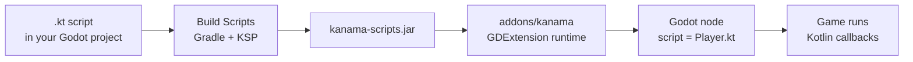

# Getting Started

Kanama's current public onboarding path is a source checkout. Packaged desktop
kits and store add-ons are buildable release artifacts, but they are download
flows only after matching GitHub zip artifacts are published.

| Path | Use it when | Start here |
| --- | --- | --- |
| Source checkout | You want to use Kanama today, use the current `main` branch, or validate a local Kanama change in your own project. | [Use a Source Checkout](source-checkout.md) |
| Release kit | You have a locally built or published desktop kit and want a small new Godot project without a sibling Kanama source checkout. | [Use a Release Kit](release-kit.md) |
| Store addon | You have a locally built or published store-addon zip and want to add Kanama to an existing Godot project without a sibling Kanama source checkout. | [Use a Store Addon](store-addon.md) |
| Contributor checkout | You want to work on Kanama runtime, wrappers, docs, native bootstrap, or release packaging. | [Work on Kanama](work-on-kanama.md) |

Android export is experimental and uses a separate Gradle/Android toolchain.
See [Android Experimental](../exporting/android.md) after the desktop workflow
is running.

## Requirements

Desktop Kanama projects use:

- Godot 4.7 beta 5 from the
  [Godot 4.7 beta 5 archive](https://godotengine.org/download/archive/4.7-beta5/).
- JDK 25+ for desktop runtime and Gradle builds.
- macOS arm64, Windows x64, Linux x64, or Linux ARM64 for the current desktop
  package targets.

Source and contributor workflows also require CMake 3.22.1+ and the platform C
toolchain because they build the native bootstrap locally. Package artifacts
contain the native bootstrap libraries included by their local package build or
published release artifact.

## How Kanama Fits Into Godot

Kanama `.kt` files are Godot script resources. Attach them to compatible nodes
the same way you would attach a `.gd` script. Kotlin changes must be compiled
with **Build Scripts** before Godot can run the updated behavior.

## What To Read Next

- [The Editor Loop](editor-workflow.md) for build buttons, hot reload, and
  debugging.
- [Writing Kotlin Scripts](../game-dev/scripts.md) for script structure,
  lifecycle callbacks, and `self`.
- [Calling Godot APIs](../game-dev/godot-api.md) for generated wrappers.
- [Exports and Resources](../game-dev/properties-resources.md) for inspector
  properties and node references.
- [Signals and Callbacks](../game-dev/signals.md) for Godot-style events.
