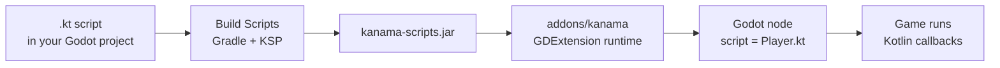

# Getting Started

This guide gets a desktop Godot project running with a Kotlin script attached
directly to a node.

## Requirements

- Godot 4.7 beta 3 from the
  [Godot 4.7 beta 3 archive](https://godotengine.org/download/archive/4.7-beta3/).
- JDK 25+ for desktop development and Gradle builds.
- CMake 3.22.1+ and a platform C toolchain for the desktop native bootstrap.
- A Kanama source checkout. The current preview installs addon artifacts from
  source instead of a published release package.

Android export is experimental and uses a separate Gradle/Android toolchain.
See [Android Experimental](../exporting/android.md) after the desktop workflow
is running.

## Platform Setup

Use the Godot binary for the platform you are testing. The current preview
validates source checkout, editor, runtime, and demo smoke workflows; packaged
desktop exports are tracked separately in
[Desktop and Packaging](../exporting/desktop.md).

| Platform | Setup notes |
| --- | --- |
| macOS arm64 | Install Temurin JDK 25 or another JDK 25 build, install CMake 3.22.1+ and Xcode command line tools, use `/Applications/Godot.app/Contents/MacOS/Godot` or a `PATH` entry for Godot, and run Gradle commands with `./gradlew`. This is the primary local maintainer workflow. |
| Windows x64 | Use the 4.7 beta 3 Windows console binary for smoke runs, install Temurin JDK 25, set `JAVA_HOME` so `%JAVA_HOME%\bin\server\jvm.dll` exists, install Visual Studio 2022 with **Desktop development with C++** for native bootstrap builds, and run Gradle commands in PowerShell with `.\gradlew.bat`. Git Bash smoke scripts are supported for marker checks. |
| Linux x64 | Install JDK 25, set `JAVA_HOME`, install CMake 3.22.1+, preflight `libkanama_bootstrap.so` with `file`, `ldd`, and `readelf` for release validation, set `XDG_DATA_HOME` to an isolated directory for repeatable headless/editor runs, and refresh demo addons with `installAddonJar`. |
| Linux ARM64 | Use the same Linux setup with the ARM64 Godot binary. Validation currently covers local runtime, editor, and demo smoke workflows; packaged desktop exports are tracked separately. |
| Android | Keep Android experimental. Use JDK 21 for Android Gradle/export tooling, Android SDK API 36 with build-tools 36.1.0 and NDK 29.0.14206865, matching Godot 4.7 beta 3 Android export templates, `installAndroidPluginAar`, and the emulator/Pixel 7 smoke path before updating release claims. |

Building Kanama from source does not require a Godot source checkout. The
desktop native bootstrap uses the GDExtension headers tracked in this
repository, JDK 25 headers, CMake, and the platform C toolchain.

## How Kanama Fits Into Godot



Kanama `.kt` files are Godot script resources. Attach them to compatible nodes
the same way you would attach a `.gd` script.

## 1. Clone Kanama

```sh
git clone https://github.com/falcon4ever/kanama
cd kanama
```

The current preview installs from this source checkout. Keep the checkout next
to or near your Godot projects so the editor plugin can find `gradlew`, or set
`kanama/tools/repo_dir` in Godot project settings.

## 2. Create a Starter Project

Use `createStarterProject` for a new, ready-to-open Godot project:

```sh
./gradlew createStarterProject \
  -PkanamaStarterProjectDir=/absolute/path/to/kanama-starter
```

This creates a tiny `main.tscn` with `HelloScript.kt` attached to a `Node2D`
and enables the optional `Kanama Tools` editor plugin.

If you already have a Godot project, use the copy-only task instead:

```sh
./gradlew installStarterTemplate \
  -PkanamaStarterProjectDir=/absolute/path/to/godot_project
```

`installStarterTemplate` copies `HelloScript.kt` and `addons/kanama_tools`
without creating or replacing `project.godot`.

## 3. Build and Sync Kanama

Build the runtime, native bootstrap, and project Kotlin scripts into the Godot
project:

```sh
./gradlew installAddonJar \
  -PkanamaProjectDir=/absolute/path/to/kanama-starter \
  -PkanamaProjectScriptsDir=/absolute/path/to/kanama-starter
```

This writes `addons/kanama`, compiles the project `.kt` files into
`kanama-scripts.jar`, and registers the GDExtension in
`.godot/extension_list.cfg`.

If your Kotlin scripts live outside the project root, point
`kanamaProjectScriptsDir` at that folder. For multiple roots, use
`-PkanamaProjectScriptsDirs=` with path-separated or comma-separated paths.

## 4. Open and Run

1. Open `/absolute/path/to/kanama-starter/project.godot` in Godot.
2. Confirm **Kanama Tools** is enabled in **Project > Project Settings > Plugins**.
3. Press **Play**.
4. Edit `HelloScript.kt`.
5. Press **Build Scripts** in the Godot toolbar.
6. Press **Play** again.

The starter scene updates a label from Kotlin and rotates the root `Node2D`.

## 5. Edit the Script

Kanama scripts are ordinary Kotlin files. Edit them in IntelliJ IDEA or another
Kotlin-aware editor, then press **Build Scripts** or run `installAddonJar`
again after changes.

The starter script looks like this:

```kotlin
package com.example.game

import net.multigesture.kanama.annotations.ClassName
import net.multigesture.kanama.annotations.OnProcess
import net.multigesture.kanama.annotations.OnReady
import net.multigesture.kanama.annotations.PropertyHint
import net.multigesture.kanama.annotations.RegisterFunction
import net.multigesture.kanama.annotations.ScriptClass
import net.multigesture.kanama.annotations.ScriptProperty
import net.multigesture.kanama.annotations.Tool
import net.multigesture.kanama.api.GD
import net.multigesture.kanama.api.KanamaScript
import net.multigesture.kanama.api.Label
import net.multigesture.kanama.api.Node2D
import java.lang.foreign.MemorySegment

@ScriptClass(attachTo = "Node2D")
@ClassName
@Tool
class HelloScript(godotObject: MemorySegment) :
    KanamaScript<Node2D>(godotObject, ::Node2D) {
    @ScriptProperty(hint = PropertyHint.RANGE, hintString = "0,4,0.1")
    var spinSpeed: Double = 0.6

    @ScriptProperty
    var greeting: String = "Hello from Kanama"

    private var elapsedSeconds = 0.0
    private var statusLabel: Label? = null

    @OnReady
    fun ready() {
        statusLabel = self.getNodeAsOrNull("Status", "Label", ::Label)
        updateStatus("ready")
        GD.print("[kanama:starter] $greeting")
    }

    @OnProcess
    fun process(delta: Double) {
        elapsedSeconds += delta
        self.rotation = elapsedSeconds * spinSpeed
        updateStatus("running for %.1fs".format(elapsedSeconds))
    }

    @RegisterFunction
    fun greet(name: String): String = "$greeting, $name"

    private fun updateStatus(state: String) {
        statusLabel?.text = "$greeting\nKotlin script is $state."
    }
}
```

The constructor receives the Godot object handle. `KanamaScript<Node2D>` gives
the script a typed `self` wrapper for the attached node. Higher-level examples
in the game development pages show node references, custom signals, resources,
RPC, and larger gameplay scripts.

## Troubleshooting

| Symptom | Fix |
| --- | --- |
| Godot cannot find `libjvm`. | Install JDK 25+ and set `JAVA_HOME` to the JDK home directory. |
| Godot still runs old Kotlin behavior. | Press **Build Scripts** or rerun `installAddonJar`; Kotlin changes must be compiled. |
| `Build Scripts` cannot find `gradlew`. | Set `kanama/tools/repo_dir` to the Kanama source checkout in Godot project settings. |
| Godot reports missing `res://*.kt` scripts. | Rerun `installAddonJar` and reopen/import the project once so the GDExtension is registered. |

## Editor Tools

The starter template includes `res://addons/kanama_tools`. Enable **Kanama
Tools** in Godot's plugin settings for the `Build Scripts` toolbar button,
`Open Kotlin` source-folder shortcut, optional build-on-save, scene reload after
sync, and JDWP debugging settings.

See [The Editor Loop](editor-workflow.md) for hot reload and the IntelliJ
debugger workflow.

## Source Install Notes

The current preview installs Kanama from a source checkout. See
[Desktop and Packaging](../exporting/desktop.md) for the full source-install
workflow, platform artifact notes, and packaging boundaries.

## What To Read Next

- [The Editor Loop](editor-workflow.md) for build buttons, hot reload, and
  debugging.
- [Writing Kotlin Scripts](../game-dev/scripts.md) for script structure,
  lifecycle callbacks, and `self`.
- [Exports and Resources](../game-dev/properties-resources.md) for inspector
  properties and node references.
- [Signals and Callbacks](../game-dev/signals.md) for Godot-style events.
